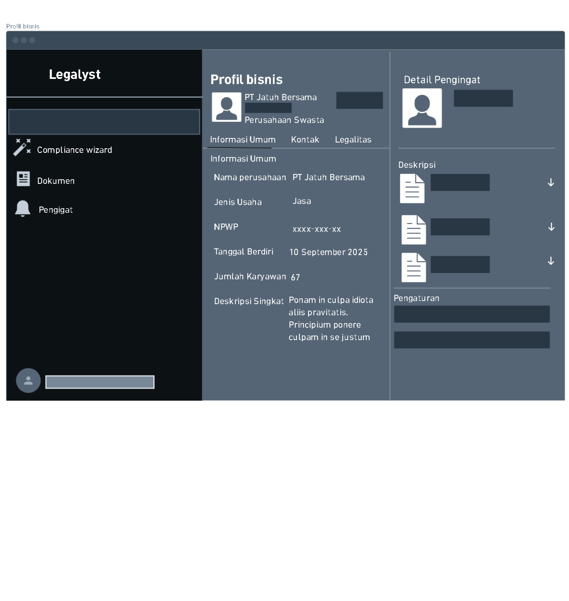
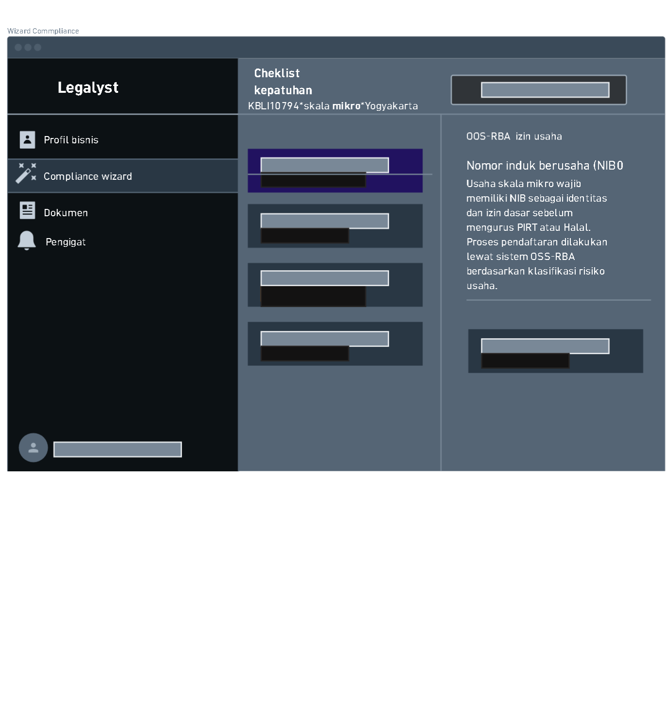
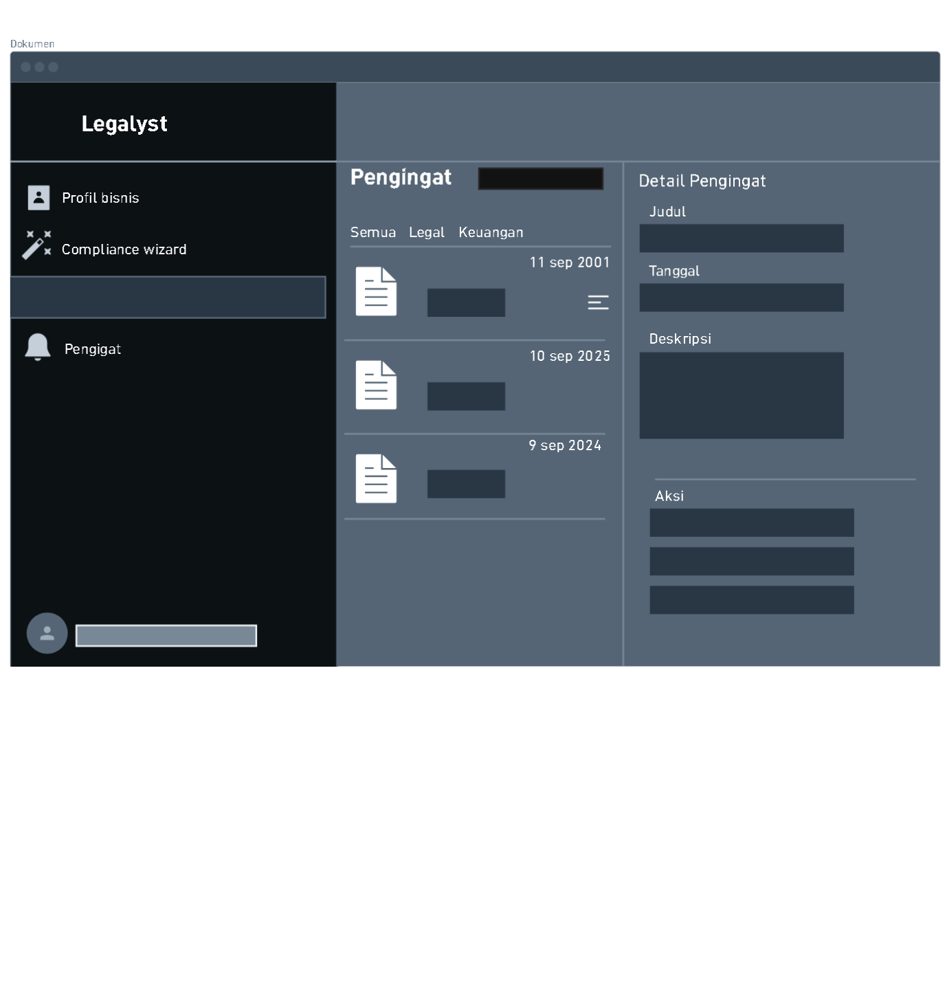
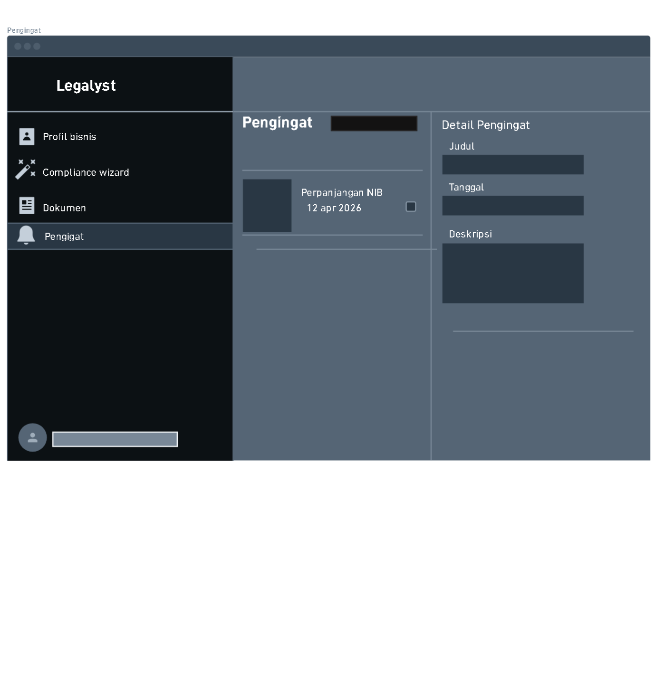

# Legalyst

## Group Identity

- Senior Project

| Name | NIU | Role |
|---|---|---|
|Altaf Parves Shua Ilham| 24/536741/TK/59565 | Backend Engineer |
| Calvin  |24/532894/TK/59025 | AI Engineer |
|Diffie Alfierie Iswanto | 24/533049/TK/59056 | Frontend & UI/UX Designer |
|M Dimas Dwi Ananda |24/536904/TK/59594 | Frontend & UI/UX Designer |

## Product

**Legalyst** is a web platform that helps Indonesian F&B and retail micro and small businesses (MSMEs) figure out exactly which government licenses, certifications, and tax filings apply to them — and how to complete each one — without needing prior legal knowledge or the budget for a consultant.

Instead of navigating separate portals and dense regulatory language across OSS-RBA, KBLI 2020, PIRT, Halal certification, and annual SPT tax filing, users describe their business in plain Bahasa Indonesia. Legalyst matches this description to the correct KBLI classification, generates a personalized compliance checklist with every item traced back to its source regulation, and auto-generates the draft documents needed to fulfill each requirement.

The goal is simple: give small business owners the same clarity on compliance that larger companies get from a legal team, at a cost and complexity level that fits a warung or home-based producer.

## Background and Problem

Indonesian MSMEs in the F&B and retail sectors must deal with several separate compliance requirements: OSS-RBA business licensing, KBLI 2020 sector classification, PIRT and Halal product certification, and annual SPT tax filing. Each requirement is managed by a different government agency and described in dense regulatory language.

Larger companies can hire legal staff to handle this. A small warung or a home-based food producer usually cannot, and this often leads to unintentional non-compliance. Existing tools do not solve this problem well: most assume the user already knows what to apply for, or they cost more than an MSME can afford.

## Proposed Solution and Feature Design

Legalyst gives an F&B or retail micro or small business a single place to find out exactly which licenses, certifications, and filings apply to them, and how to complete each one. The MVP has three core features:

| Feature | Description |
|---|---|
| Smart Onboarding & Business Profiler | The user describes their business in plain Bahasa Indonesia. The description is embedded and matched against the official KBLI 2020 codebook, returning the top three candidate codes with confidence scores for the user to confirm or override. |
| Interactive Compliance Wizard | A rule engine filters the obligation table by KBLI code, business scale, and location, while vector search retrieves the relevant regulation clauses. Both feed a language model that produces a personalised, plain-language checklist in which every item cites its source regulation. Obligations the rule engine cannot confirm are flagged "verify manually" rather than dropped. |
| Auto-Document Generator | Checklist items are turned into draft documents by populating templates with the user's profile data and rendering them to PDF for download. |

## Low-Fidelity Wireframes

Mobile-first low-fidelity wireframes for the core screens, covering the primary flow from business profile setup through the compliance wizard, generated documents, and reminders (Lab 2.4 deliverable).

| Screen | Description |
|---|---|
| Profil Bisnis | Business profile view — company info, legal details, and linked documents |
| Compliance Wizard | Personalized compliance checklist for a given KBLI code, business scale, and location, with the source regulation shown alongside each item |
| Dokumen | List of generated documents and reminders, filterable by category (Legal / Keuangan) |
| Pengingat | Detail view for a single reminder (e.g. an upcoming license renewal) |

## Product Goals

- Help Indonesian F&B and retail MSMEs (micro and small businesses) correctly identify which government licenses, certifications, and tax obligations apply to their specific business, without needing prior legal or regulatory knowledge.
- Reduce unintentional non-compliance among MSMEs by translating dense, agency-specific regulatory language (OSS-RBA, KBLI 2020, PIRT, Halal, SPT) into a single, plain-language, personalized checklist.
- Lower the cost and effort barrier to compliance for micro-businesses that cannot afford legal staff or paid consulting services like Easybiz.id or Justika.com.
- Accelerate the document preparation process by auto-generating draft compliance documents from the user's business profile, reducing manual form-filling errors.
- Build user trust through source-cited recommendations (every checklist item traces back to its regulation) and transparent flagging of items the system cannot confidently confirm ("verify manually"), rather than silently omitting them.

## Potential Product Users and Their Needs

| User Segment | Description | Needs |
|---|---|---|
| Home-based food producers (PIRT-scale) | Individuals producing packaged food/beverages from home, often first-time business owners | Simple, jargon-free way to know if they need PIRT/Halal certification; low/no-cost guidance |
| Warung and small F&B outlet owners | Small food stalls/restaurants with limited staff and no legal/admin department | Fast way to determine required licenses (OSS-RBA, KBLI classification) without hiring consultants |
| Small retail shop owners | Micro/small retailers selling physical goods | Clarity on which business licensing and tax obligations apply to their specific retail category |
| Growing MSMEs preparing to formalize | Businesses transitioning from informal to formal legal status | Step-by-step onboarding to determine correct KBLI code and a complete, personalized obligation checklist |
| MSME owners facing annual tax filing (SPT) | Business owners unfamiliar with tax deadlines/forms | Reminders and guidance integrated with their specific business profile, not generic tax info |

## Functional Requirements for the Designed Use Cases

| FR | Description |
|---|---|
| FR 1 | The system shall allow the user to input a free-text description of their business in Bahasa Indonesia. |
| FR 2 | The system shall embed the user's business description and match it against the KBLI 2020 codebook, returning the top three candidate codes with confidence scores. |
| FR 3 | The system shall allow the user to confirm one of the suggested KBLI codes or manually override it with a different code. |
| FR 4 | The system shall filter the obligation table using the confirmed KBLI code, business scale, and business location via a rule engine. |
| FR 5 | The system shall retrieve relevant regulation clauses related to the filtered obligations using vector search. |
| FR 6 | The system shall generate a personalized, plain-language compliance checklist by combining rule-engine output and retrieved regulation clauses through a language model. |
| FR 7 | The system shall display, for every checklist item, a citation to its source regulation. |
| FR 8 | The system shall flag any obligation the rule engine cannot confidently confirm as "verify manually" instead of omitting it from the checklist. |
| FR 9 | The system shall allow the user to select a checklist item and generate a draft document by populating a template with their business profile data. |
| FR 10 | The system shall render generated draft documents into downloadable PDF format. |
| FR 11 | The system shall allow the user to download the generated PDF document. |

## System Design

### Use Case Diagram

The primary actor is the MSME business owner, interacting with Legalyst end-to-end: entering their business profile, reviewing and confirming the suggested KBLI code, viewing their generated compliance checklist and its source regulations, and generating/downloading draft documents.

### Entity Relationship Diagram

The data model separates the regulatory corpus (`kbli_code`, `regulation_source`, `regulation_clause`, `compliance_obligation`, `applicability_rule`) from a business's own data (`business`, `business_kbli`, `compliance_checklist`, `checklist_item`, `generated_document`), with citation join tables (`rule_citation`, `checklist_item_citation`) linking checklist items back to the exact regulation clauses that justify them.

## Competitor Analysis

| Competitor | Type | Product | Strengths | Weaknesses |
|---|---|---|---|---|
| OSS-RBA Portal (oss.go.id) | Direct | Official government licensing portal | Authoritative and free | Assumes the user already knows their KBLI code and which permits apply; no guidance layer |
| Easybiz.id | Direct | Paid business permit consulting service | Handles the full filing process | Priced for established companies, beyond a micro business budget |
| Justika.com | Indirect | Online legal consultation marketplace | Access to real lawyers | Per-consultation pricing and general legal scope, not a structured compliance path |

## Project Timeline

Sprint 0 = Session 1–4 · Sprint 1 = Session 5–6 · Sprint 2 = Session 7–8 · Sprint 3 = Session 9–11 · Demo = Session 12

| Activity | 1 | 2 | 3 | 4 | 5 | 6 | 7 | 8 | 9 | 10 | 11 | 12 |
|---|:-:|:-:|:-:|:-:|:-:|:-:|:-:|:-:|:-:|:-:|:-:|:-:|
| Brainstorming | ● | ● | | | | | | | | | | |
| Requirement Analysis | | ● | ● | | | | | | | | | |
| Sprint 0 — Infrastructure & Corpus | | | ● | ● | | | | | | | | |
| Sprint 1 — Business Profiler (AI) | | | | | ● | ● | | | | | | |
| Sprint 2 — Compliance Wizard (RAG) | | | | | | | ● | ● | | | | |
| Sprint 3 — Document Generator | | | | | | | | | ● | ● | | |
| Integration & Testing | | | | | | | | | | ● | ● | |
| Azure Deployment | | | ● | ● | | | | | | | ● | |
| Usability Testing | | | | | | | | | | | ● | |
| Documentation | | ● | ● | ● | ● | ● | ● | ● | ● | ● | ● | ● |
| Demo Preparation | | | | | | | | | | | | ● |
