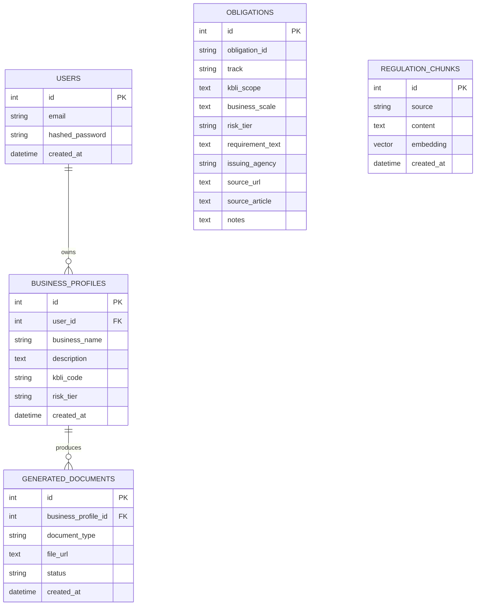

# Database Schema

**Migration:** [`backend/alembic/versions/1dda096b9349_initial_schema.py`](../backend/alembic/versions/1dda096b9349_initial_schema.py)
**Models:** [`backend/app/models.py`](../backend/app/models.py)

## ERD



## Tables

- **`users`** — auth accounts (#18).
- **`business_profiles`** — one row per submitted business description; `kbli_code` and `risk_tier` are filled in once the profiler (Sprint 1) and OSS-RBA matching run.
- **`obligations`** — the compiled regulation corpus (OSS/PIRT/HALAL/SPT). Columns mirror [`data/TEMPLATE_obligations.csv`](../data/TEMPLATE_obligations.csv) — see [`data/README.md`](../data/README.md) for the fill-in rules. `obligations` isn't linked by a foreign key to `business_profiles`; the checklist match is computed at query time by intersecting `kbli_scope`/`business_scale`/`risk_tier`, not stored as a relation.
- **`regulation_chunks`** — embedded text chunks for retrieval. `embedding` is `vector(1536)` (matches OpenAI/Azure OpenAI's `text-embedding-3-small` dimension) with an HNSW index (`vector_cosine_ops`) for cosine-similarity search.
- **`generated_documents`** — output of the Sprint-3 document generator; `file_url` points at Blob Storage (#32).

## Running the migration

Local (Docker Postgres + pgvector — see [`docker-compose.yml`](../docker-compose.yml)):

```bash
docker compose up -d postgres
cd backend
alembic upgrade head
```

Against Azure once #5 is provisioned: point `DATABASE_URL` at the Azure Postgres Flexible Server connection string (from the GitHub Secret, not committed) and run the same `alembic upgrade head`.

## Status

Written and verified against a local Postgres 16 + pgvector container (`docker compose up -d postgres` → `alembic upgrade head` → tables, `vector(1536)` column, and the HNSW index all confirmed; downgrade/re-upgrade also verified). Not yet run against the real Azure DB — blocked on [#5](https://github.com/altafparves/Legalyst/issues/5).
